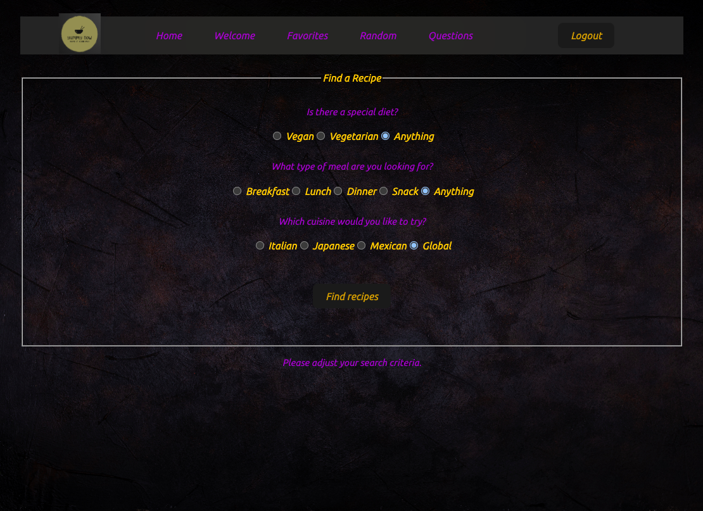

# Installationguide

## 1.Introduction
Welcome to the Yummynow project!
Yummynow is a application programming interface (API) that allows users to search for recipes.
After registration and login the user can also like and save the recipes.


## 2.Screenshot



In the image above you see the question page where the user can make a selection of the
recipes he wants to see.


## 3.Requirements

To run this project you'll need:
-Node.js
-Webstorm with Vite and React
-Git.

We use the Edamam API to get the recipes. www.edamam.com
The Application ID en Application key are stored in an .env file in the root of the project.
We need to add this to every request you make to the API.

We use the Novi backend to save the user's data like user name, email and password.
www.novi.datavortex.nl
Also this Application key and Basis URI are stored in an .env file in the root of the project.


## 4.Run the project

First you'll need to clone the repository to your local machine:
Press the green code button, copy the URL to your clipboard and then, after opening your webstorm
press 'Get from VCS' and paste the URL in the URL field.
Now the project is on your computer, you can start the project by opening the terminal and probably
your computer already suggests ndm install just press yes, otherwise type npm install
in the terminal and press enter. When everything is installed type npm run dev in the terminal and
press enter.
Now the project should be running on your local machine.


## 5. Extra command’s

Every time you change something its good to run it again with npm run dev. You can also use the green 
play button in the top right corner of your webstorm. This will also run the project.

## 6.Testusage**

To use the application fully you need to register and login.
You can easily make a new account or use the following:
```
username: elinevdw
password: wachtwoord

```

Enjoy! :)

# YummyNow